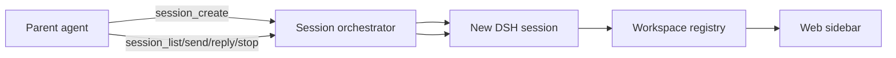

# Design

## Scope

`session_control` adds global-by-default session and project orchestration. It
uses existing DSH services as the source of truth and contributes only the
model-facing tools, authorization policy, and settings surface.

## Existing DSH Components

| Component                                           | Complete capability reused by `session_control`                                             | Remaining gap                                                               |
| --------------------------------------------------- | ------------------------------------------------------------------------------------------- | --------------------------------------------------------------------------- |
| `dsh-tool-session-query`                            | Workspace-authorized history search, event reads, and lineage tracing                       | Read-only; it cannot create, resume, stop, or archive sessions              |
| `dsh-tool-subagent` and `dsh-tool-subagent-control` | Create related child sessions, list descendants, send follow-ups, and interrupt child turns | Limited to subagent lineage rather than ordinary workspace sessions         |
| `dsh-workspace`                                     | Durable workspace membership and archive storage                                            | Service API only; no model-facing mutation tools                            |
| `dsh-client-ui-workspace`                           | Human-facing create, fork, rename, search, archive, status, and sidebar rendering           | Not model-facing; no archived-session viewing or unarchive control          |
| `dsh-tool-cordis`                                   | Dynamically define and mount process-local tools and UI extensions                          | Volatile meta-programming surface, not a durable session-management product |

`session_control` should remain a thin consumer over these packages. It owns model-facing authorization and lifecycle commands, while the official query, workspace, agent, persistence, and Web UI services remain authoritative.

## Authorization

Global management is enabled by default. The `session-control.allowGlobalAccess`
setting can be changed live from the Web settings card. When disabled, the
caller's immutable session `cwd` resolves to exactly one DSH workspace and all
session/project targets must belong to that workspace. Workspace registration
(`workspace_create`) is only available in global mode.

## Lifecycle

1. `session_create` creates a new DSH session with `parentSession` set to the caller, attaches it to the caller's workspace or an explicitly selected workspace, then queues the initial task.
2. The Web sidebar discovers it through the existing workspace session projection. No custom sidebar store is required.
3. `session_send` resumes a cold persisted session only after the workspace membership check, then queues a follow-up.
4. `session_reply` scans the current durable log backward for the latest relay source, authorizes that sender as a target, resumes it when cold, and queues a reply carrying the current session id.
5. `session_stop` cancels only the active turn and preserves queued messages.
6. `session_archive` is disabled unless deployment configuration enables it. It refuses to archive the caller or a running session.
7. `workspace_list`, `workspace_create`, `workspace_rename`, `workspace_remove`,
   and `workspace_sessions` expose durable top-level project management while
   retaining the registry's directory and session-log safety guarantees.

## Package Boundary

Remote execution is intentionally outside this package. A separate remote
plugin may integrate with DSH's subagent provider interfaces without coupling
SSH credentials, host lifecycle, or path mapping to session discovery and
project registration.

Cross-authority agent messaging uses the transport-neutral `SessionRelayService`. This package owns address parsing, provider registration, local delivery, and durable reply attribution. Authority plugins such as `dsh-remote` own protocol validation, connections, reconnection, and transport status. The SSH transport design is in [the dsh-remote relay reference](../remote/RELAY_DESIGN.md).
